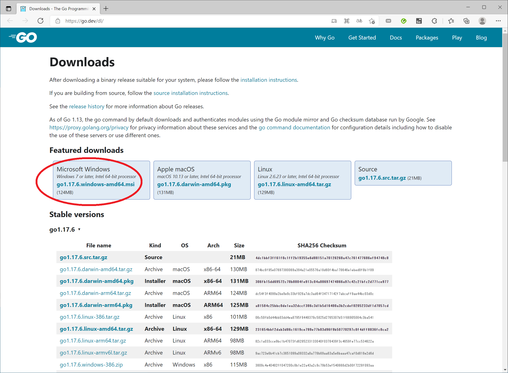
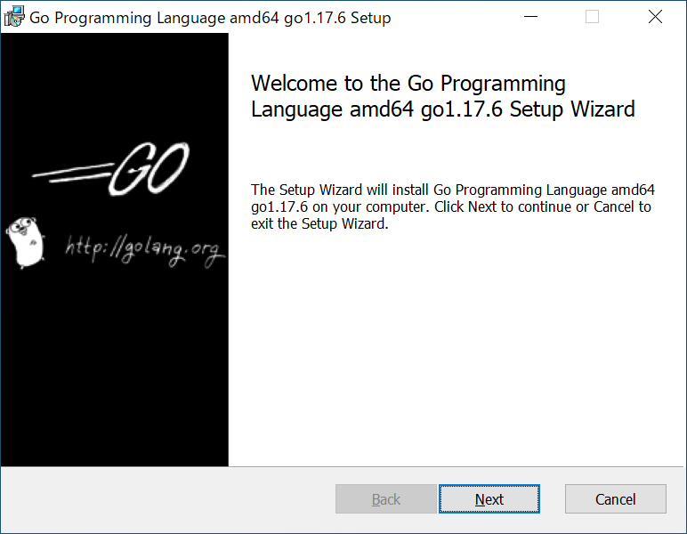
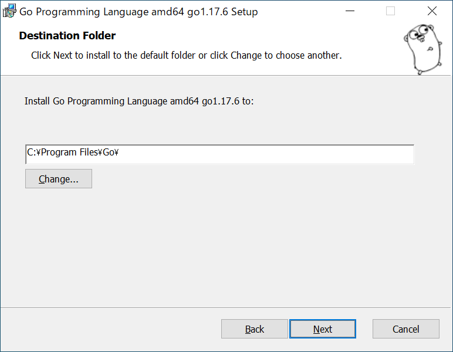
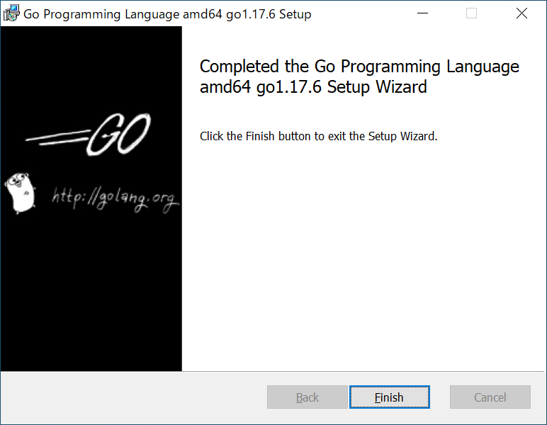

# Go言語のインストール

  

📖 [Go Downloads](https://go.dev/dl/)  

👆 Go 言語のダウンロードページ から `*.msi` ファイルをクリックしてください  

以下、どんどん次へ進んでください  

  

  

  

👆 このディレクトリは 特にこだわりがなければ デフォルトのままで  

  

  

👆 これでインストール作業は終わりました。  
次に、ちゃんとインストールされているか確認しましょう  

  

👆 Windows の検索欄に `cmd` と打鍵して、 `コマンド プロンプト` を選択してください  

  

👆 `go version` と打鍵して、バージョン番号が表示されれば　Go言語のインストールができています。  
お疲れさまでした  
